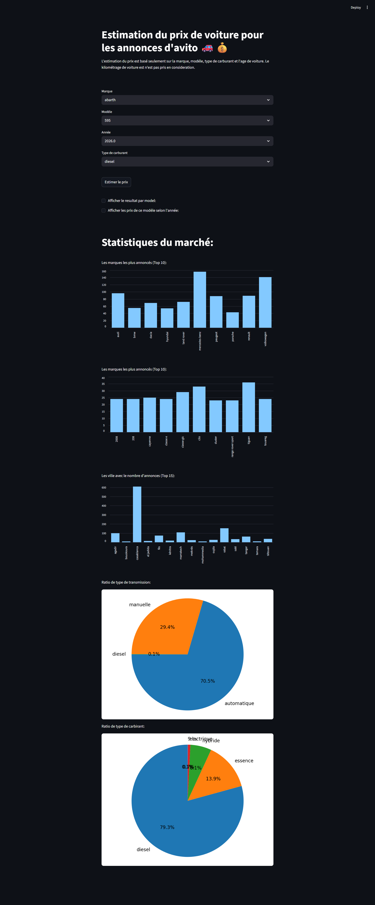

# Avito.ma Cars Scraper & Price Estimator 🚗💰

This project started as a **web scraper** for car listings on **Avito.ma**, but it has evolved into a full **data pipeline** including **data cleaning, analysis, machine learning models for price prediction, and an interactive Streamlit UI**.

---

## Project Overview

### Original Scraper Architecture

The project contains **two complementary scrapers**:

1. **⚡ Light Scraper** – Fast, minimal data extraction from listing pages.
2. **🐢 Standard Scraper** – Slower, detailed extraction from individual listings.

This dual approach balances **speed** and **data completeness**.

#### Light Scraper

* Scrapes listing pages quickly (≈8–10 sec per page)
* Collects:

  * Listing link, type, title
  * City, district
  * Year, date of listing
  * Basic tags (fuel, transmission, etc.)

#### Standard Scraper

* Visits individual listings (≈30 sec per page)
* Collects full information:

  * Title, listing type, price
  * City, district, owner, mileage
  * Make, model, technical specs
  * Images and links

---

### Data Cleaning & Analysis

After scraping, the dataset is **cleaned, filtered for duplicates and outliers**, and analyzed.
Key analyses include:

* Average/median price and mileage
* Top cities, brands, and models
* Price trends by year and model
* Market statistics by fuel type and transmission

---

### Machine Learning & Price Prediction

The project implements **four regression models** for predicting car prices based on:

* Brand (`marque`)
* Model (`modele`)
* Age (`car_age`)
* Fuel type (`carburant`)

Models used:

* Linear Regression
* Decision Tree Regressor
* Random Forest Regressor
* K-Nearest Neighbors Regressor

**Outlier filtering** ensures better predictions by removing extreme prices and rare brands.

---

### Streamlit UI

A user-friendly **web interface** allows users to:

* Select car brand, model, year, and fuel type
* Get **estimated price ranges**
* View predictions from individual models
* Visualize **price trends over years**
* Explore **market statistics**:

  * Top brands and models
  * Cities with most listings
  * Transmission & fuel type distribution

**Example features in the UI:**

* Estimated price with ±10% range
* Price trends by model over the years
* Bar charts and pie charts for market insights

---

### Project Architecture

```
avito-car-scraper/
├── app/                      # Streamlit UI
│   └── app.py
├── models/                   # Saved ML models (.pkl)
├── notebooks/
│   ├── basic_analysis.ipynb  # Exploratory data analysis
│   └── regression_models.ipynb # ML modeling & evaluation
├── data/
│   └── avito_clean.csv       # Cleaned dataset
├── light_scraper.py          # Light listings scraper
├── standard_scraper.py       # Detailed listing scraper
├── requirements.txt
└── README.md
```

---

### Tech Stack

* **Python 3.9+**
* Web Scraping: `requests`, `BeautifulSoup`
* Data Analysis: `pandas`, `numpy`, `matplotlib`
* Machine Learning: `scikit-learn`, `joblib`
* UI: `Streamlit`
* Interactive Widgets: `ipywidgets`

---

### Installation

```bash
# Clone the repository
git clone https://github.com/ahmed61911/avito.ma-web-scrapper.git
cd avito-car-scraper

# Install dependencies
pip install -r requirements.txt
```

---

### Usage

**Run the Streamlit app:**

```bash
streamlit run app/app.py
```

**Run the scrapers:**

```bash
# Light Scraper
python light_scraper.py

# Standard Scraper
python standard_scraper.py
```

**Run analysis or model training (optional, in Jupyter notebooks):**

```bash
jupyter notebook notebooks/basic_analysis.ipynb
jupyter notebook notebooks/regression_models.ipynb
```

---

### Author

**Ahmed Baba**
*AI/ML Developer | Python & Data Enthusiast*

---

### Future Work

* Add **more features** for price prediction (mileage, options, condition)
* Integrate **real-time scraping** for up-to-date predictions
* Deploy as a **web service** for public use

---

### Screenshots / Visualization

